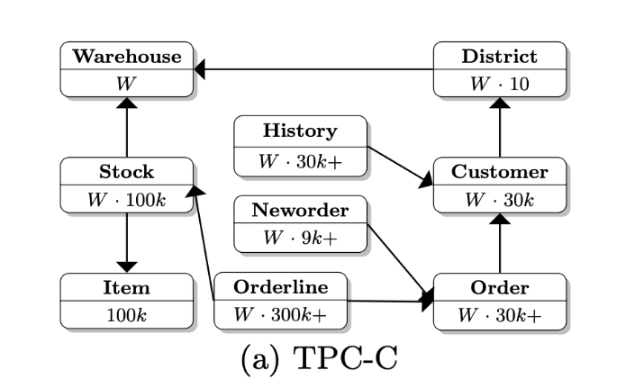

# Java TPC-C


This project is a Java implementation of the TPC-C benchmark.


# 编译代码


Use this command to compile the code and produce a fat jar.

```
mvn package assembly:single
```

# 导入数据表结构

To create the tpcc schema in MySQL:

```
cd database
mysql -u root
> create database tpcc;
> use tpcc;
> source create_tables.sql
> source add_fkey_idx.sql
```
成功导入 create_tables.sql和add_fkey_idx.sql 后，会看到如下表：
```
customer
district
history
item
new_orders
order_line
orders
stock
```
It is possible to load data without the foreign keys and indexes in place and then add those
after loading data to improve loading times.

# 生产TPCC数据

Data can be loaded directly into a MySQL instance and can also be generated to CSV files that
can be loaded into MySQL later using LOAD DATA INFILE.

In `tpcc.properties` set the MODE to either CSV or JDBC.

To run the load process:

```
java -classpath target/tpcc-1.0.0-SNAPSHOT-jar-with-dependencies.jar com.codefutures.tpcc.TpccLoad
```

It is possible to load data into shards where the warehouse ID is used as a shard key. The
SHARDCOUNT and SHARDID properties must be set correctly when generating or loading data.

This option requires the use of a JDBC driver that supports automatic sharding, such as
dbShards (http://www.dbshards.com).

# 运行压测，不断制作新增更新数据

Review the TPC-C settings in `tpcc.properties`, then run this command To run the tpcc benchmarks:

```
java -classpath target/tpcc-1.0.0-SNAPSHOT-jar-with-dependencies.jar com.codefutures.tpcc.Tpcc
```

结果如下：
```
<Raw Results>
  |NewOrder| sc:5643  lt:0  rt:0  fl:0 
  |Payment| sc:5651  lt:0  rt:0  fl:0 
  |Order Stat| sc:565  lt:0  rt:0  fl:0 
  |Delivery| sc:566  lt:0  rt:0  fl:0 
  |Slev| sc:565  lt:0  rt:0  fl:0 
 in 120.411003 sec.
<Raw Results2(sum ver.)>
  |NewOrder| sc:5644  lt:0  rt:0  fl:0 
  |Payment| sc:5651  lt:0  rt:0  fl:0 
  |Order Stat| sc:565  lt:0  rt:0  fl:0 
  |Delivery| sc:566  lt:0  rt:0  fl:0 
  |Slev| sc:565  lt:0  rt:0  fl:0 
<Constraint Check> (all must be [OK])
 [transaction percentage]
        Payment: 43.502694% (>=43.0%) [OK]
   Order-Status: 4.349500% (>= 4.0%) [OK]
       Delivery: 4.357198% (>= 4.0%) [OK]
    Stock-Level: 4.349500% (>= 4.0%) [OK]
 [response time (at least 90% passed)]
      NewOrder: 100.000000%  [OK]
      Payment: 100.000000%  [OK]
      Order Stat: 100.000000%  [OK]
      Delivery: 100.000000%  [OK]
      Slev: 100.000000%  [OK]
 NewOrder Total: 5643
 Payment Total: 5651
 Order Stat Total: 565
 Delivery Total: 566
 Slev Total: 565

<TpmC>
2811.8694 TpmC

```
其中  sc:success 、  lt:late 、 rt:retry 、 fl:failure
