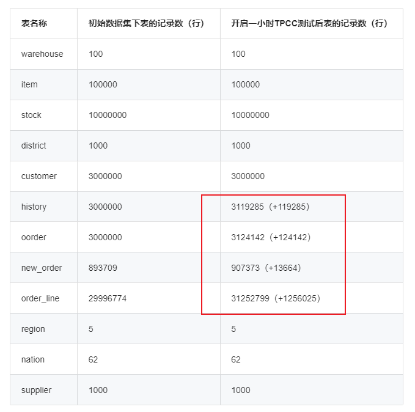
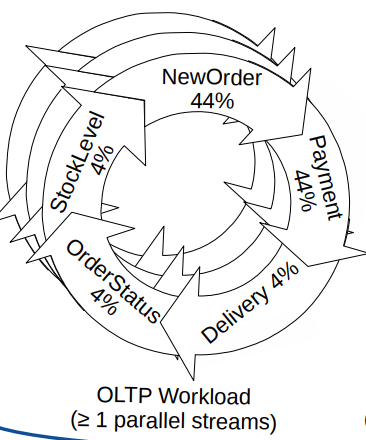

# Java TPC-C


This project is a Java implementation of the TPC-C benchmark.

## 介绍
TPC-C 于 1992 年 7 月 23 日认可为新的基准测试。TPC(Transaction Processing Performance Council，事务处理性能委员会)-C是衡量联机事务处理（OLTP，Online TransactionProcessing）系统的工业标准，是行业中公认的权威和最为复杂的在线事务处理基准测试。它通过模拟仓库和订单管理系统，测试广泛的数据库功能，包括查询、更新和  mini-batch事务（队列式小批量事务）。TPC-C基准测试针对一种模拟订单录入与销售环境测量每分钟事务（tpmC-transactions per minute）吞吐量。

## 测试模型
测试用到的模型是一个大型的批发销售公司，在地理分布的多个区域有业务，并且使用仓库管理。当业务扩展的时候，公司将添加新的仓库。每个仓库负责十个区域的供货，每个区域 3000 个客户服务，每个仓库维护 100000 种商品的库存纪录。


TPC-C 标准测试模拟了 5 种事务处理，通过这些事务处理来模拟真实的用户操作,事务分别为新订单（New-Order）、支付操作(Payment)、订单状态查询(Order-Status)、发货(Delivery)、库存状态查询(Stock-Level)。下面将对其执行的事务内容及特点进行详细介绍.

1．新订单（New-Order）

事务内容：对于任意一个客户端,从固定的仓库随机选取 5-15  件商品,创建新订单.其中 1%的订单要由假想的用户操作失败而回滚。

主要特点：中量级、读写频繁、要求响应快.

2．支付操作(Payment)

事务内容：对于任意一个客户端,从固定的仓库随机选取一个辖区及其内用户,采用随机的金额支付一笔订单,并作相应历史记录。

主要特点：轻量级，读写频繁，要求响应快

3．订单状态查询(Order-Status)

事务内容：对于任意一个客户端,从固定的仓库随机选取一个辖区及其内用户,读取其最后一条订单,显示订单内每件商品的状态。

主要特点：中量级，只读频率低，要求响应快

4．发货(Delivery)

事务内容：对于任意一个客户端,随机选取一个发货包,更新被处理订单的用户余额,并把该订单从新订单中删除.

主要特点：1-10 个批量，读写频率低，较宽松的响应时间

5．库存状态查询(Stock-Level)

事物内容：对于任意一个客户端,从固定的仓库和辖区随机选取最后 20 条订单,查看订单中所有的货物的库存,计算并显示所有库存低于随机生成域值的商品数量.

主要特点：重量级,只读频率低,较宽松的响应时间.
# 编译代码


Use this command to compile the code and produce a fat jar.

```
mvn package assembly:single
```

# 导入数据表结构

To create the tpcc schema in MySQL:

```
cd database
mysql -u root
> create database tpcc;
> use tpcc;
> source create_tables.sql
> source add_fkey_idx.sql
```
成功导入 create_tables.sql和add_fkey_idx.sql 后，会看到如下表：
```
customer
district
history
item
new_orders
order_line
orders
stock
```
It is possible to load data without the foreign keys and indexes in place and then add those
after loading data to improve loading times.

# 生产TPCC数据

Data can be loaded directly into a MySQL instance and can also be generated to CSV files that
can be loaded into MySQL later using LOAD DATA INFILE.

In `tpcc.properties` set the MODE to either CSV or JDBC.

To run the load process:

```
java -classpath target/tpcc-1.0.0-SNAPSHOT-jar-with-dependencies.jar com.codefutures.tpcc.TpccLoad
```

It is possible to load data into shards where the warehouse ID is used as a shard key. The
SHARDCOUNT and SHARDID properties must be set correctly when generating or loading data.

This option requires the use of a JDBC driver that supports automatic sharding, such as
dbShards (http://www.dbshards.com).

# 运行压测，不断制作新增更新数据

Review the TPC-C settings in `tpcc.properties`, then run this command To run the tpcc benchmarks:

```
java -classpath target/tpcc-1.0.0-SNAPSHOT-jar-with-dependencies.jar com.codefutures.tpcc.Tpcc
```

结果如下：
```
<Raw Results>
  |NewOrder| sc:5643  lt:0  rt:0  fl:0 
  |Payment| sc:5651  lt:0  rt:0  fl:0 
  |Order Stat| sc:565  lt:0  rt:0  fl:0 
  |Delivery| sc:566  lt:0  rt:0  fl:0 
  |Slev| sc:565  lt:0  rt:0  fl:0 
 in 120.411003 sec.
<Raw Results2(sum ver.)>
  |NewOrder| sc:5644  lt:0  rt:0  fl:0 
  |Payment| sc:5651  lt:0  rt:0  fl:0 
  |Order Stat| sc:565  lt:0  rt:0  fl:0 
  |Delivery| sc:566  lt:0  rt:0  fl:0 
  |Slev| sc:565  lt:0  rt:0  fl:0 
<Constraint Check> (all must be [OK])
 [transaction percentage]
        Payment: 43.502694% (>=43.0%) [OK]
   Order-Status: 4.349500% (>= 4.0%) [OK]
       Delivery: 4.357198% (>= 4.0%) [OK]
    Stock-Level: 4.349500% (>= 4.0%) [OK]
 [response time (at least 90% passed)]
      NewOrder: 100.000000%  [OK]
      Payment: 100.000000%  [OK]
      Order Stat: 100.000000%  [OK]
      Delivery: 100.000000%  [OK]
      Slev: 100.000000%  [OK]
 NewOrder Total: 5643
 Payment Total: 5651
 Order Stat Total: 565
 Delivery Total: 566
 Slev Total: 565

<TpmC>
2811.8694 TpmC

```
其中  sc:success 、  lt:late 、 rt:retry 、 fl:failure

# 实战测试
在本次测试中，设置 warehouse 数量为100，MySQL 数据库中对应的初始数据集大小约为10G。下表展示了初始数据集下各张表的数据记录数以及开启一小时 TPC-C 测试后各张表的数据记录变化情况。


TpccLoad会模拟5个 OLTP 型负载：NewOrder, Payment, OrderStatus, Delivery 和 StockLevel


